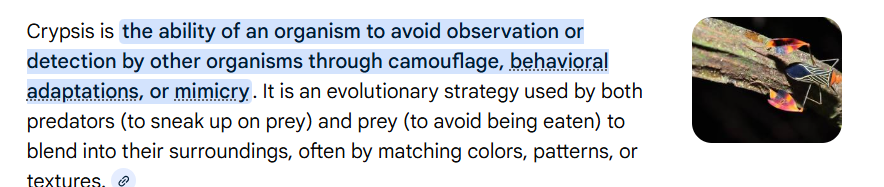

1. camouflage (like ant, like wood)
2. uv rays absorption that highlights them from the surroundings
3. orchid mantis (high contrast "allure" against foliage.)
4. chemical cues (pheromones (3HOA and 10HDA))
5. parallax to analyze closer and farther things especially when in danger?
6. one eye red, one eye purple
7. stereopsis & "head peering" (for ballistic strikes)
8. predator-prey gap

new words:
    
    masquerading
    spearer
    ambush
