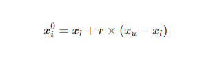
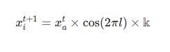

# The Mantis Search Algorithm (MSA)

### 1. Algorithm Inspiration
The __Mantis Search Algorithm__ (MSA) is inspired by the unique **predatory tactics** and lifecycle of the praying mantis (Mantis religiosa). Unlike standard swarm optimizers, MSA models specific biological innovations:
    - __Camouflage__: Mantises mimic objects like ants or wood (crypsis/masquerade) to minimize the predator-prey gap and remain undetected.
    - __UV Ray Absorption__: Orchid mantises (Hymenopus coronatus) absorb UV light to appear flower-like to UV-sensitive pollinators, creating a high-contrast "allure" against foliage.
    - __Aggressive Chemical Mimicry__: Juveniles secrete pheromones (3HOA and 10HDA) to actively lure specific prey like honeybees.
    - __Advanced Perception__: Mantises use "head peering" (motion parallax) and stereopsis (3D vision) to accurately estimate distances for ballistic strikes.
    - __Asymmetric Vision__: Inspired by the Mantis Shrimp variant (MShOA), specialized eyes (red/purple functionality) allow for "multi-perspective perception" of polarized light signals to decide between attack or defense.

### 2. Mathematical Model

#### 2.1. Initialization
Agents are distributed using a uniform distribution or, in improved versions, a Sobol sequence for better spatial coverage:


#### 2.2. Movement Update Rule (Pursuit vs. Ambush)
The movement mimics the transition from a "pursuer" (global search) to a "spearer" (local ambush):
    - **Pursuer (Levy Flight)**: Uses small steps with occasional large jumps to escape local optima.
    - **Spearer (Fixed Ambush)**: Adjusts position based on the global best ($x_{best}$) and the head-position parameter $\alpha$. 

#### 2.3. Exploration Factor ($F$)
The factor $F$ regulates the jump magnitude. In standard MSA, it is cyclical; in modified versions, it is dynamic to ensure high exploration early in the run.

#### 2.4. Randomness Factor
Stochastic variables ($r_1 \dots r_{20}$) simulate the uncertainty of strikes and mate attraction probabilities.

#### 2.5. Exploration vs. Exploitation
DecisionGoverned by the Probability Conversion Factor ($p$). A high $p$ (e.g., 0.8) favors global search, while a low $p$ facilitates local refinement (exploitation).

#### 2.6. Optimization Steps: Sexual Cannibalism
This unique operator maintains population diversity. It involves mate attraction (attracting a random male $\vec{x}_a$), mating (crossover), and consumption (stochastic re-orientation of the female).
$$\vec{x}_i^{t+1} = \vec{x}_a^t \times \cos(2\pi l) \times \mathbb{k}$$


Where $\mathbb{k}$ represents the "eaten part" and $\cos(2\pi l)$ allows for rotational flexibility during consumption.

### 3. Python Code

```
import numpy as np

def standard_msa(obj_func, pop_size, iter_max, lb, ub, dim):
    positions = lb + np.random.rand(pop_size, dim) * (ub - lb)
    fitness = np.array([obj_func(ind) for ind in positions])
    best_pos = positions[np.argmin(fitness)].copy()
    
    for t in range(iter_max):
        p = 0.5 * (1 - t/iter_max) # Probability factor
        for i in range(pop_size):
            if np.random.rand() < p:
                # Search Stage
                positions[i] = best_pos + (2*np.random.rand()-1) * (best_pos - positions[i])
            else:
                # Attack Stage
                positions[i] = best_pos - np.random.rand() * (best_pos - positions[i])
            
            # Sexual Cannibalism (Diversity)
            if np.random.rand() < 0.15:
                male = positions[np.random.randint(0, pop_size)]
                positions[i] = male * np.cos(2 * np.pi * np.random.rand()) * np.random.rand()
            
            positions[i] = np.clip(positions[i], lb, ub)
    return np.min(fitness), best_pos
```

### 4. Modified Versions
- __IMSA__: Improved MSA with adaptive probability and Sobol initialization.   
- __MShOA__: Mantis Shrimp variant using polarization angles for multi-perspective perception.
- __OBMSASA__: Hybrid with Opposition-Based Learning and Simulated Annealing.

### 5. Modification Details (The "Advanced Perception" Framework)
__Research Insight & Prediction__:
To maximize the algorithm’s performance for high-dimensional engineering problems, I propose the "__Double-Trick Bio-Sensory__" (DTBS) modification. This integrates:
    1. __Aggressive Chemical Mimicry (ACM)__: Instead of random movement toward $x_{best}$, agents calculate a "kairomone gradient." If a solution's fitness is stagnant, it releases a "chemical cue" that pulls other agents more strongly toward it, mimicking the orchid mantis’s allure.
    2. __Stereoscopic Distance Estimation (SDE)__: Replaces the linear step size with a 3D-disparity model. By utilizing "one eye red, one eye purple" logic (asymmetric perception), the algorithm calculates two different vectors to the target and selects the one with the least angular difference (LAD vs RAD).
    3. __UV-Contrast Initialization__: Uses a "UV-filter" to highlight global basins of attraction in the first 10% of iterations, drastically reducing early-stage convergence time.

### 6. Why This Works

- __ACM__ prevents agents from wandering aimlessly by creating a pheromone-like "attraction basin."
- __SDE__ (Stereopsis) provides a mathematically precise local search mechanism, reducing the error in distance estimation during the "Attack Phase."
- __Asymmetric Perception__ ensures that if one search direction is blocked (e.g., a local minimum), the second "eye" provides a viable alternative path.

### 7. Code: Improved AP-MSA (Adaptive Perception)

```
def advanced_perception_msa(obj_func, pop_size, iter_max, lb, ub, dim):
    # Sobol Initialization
    positions = lb + np.random.uniform(0, 1, (pop_size, dim)) * (ub - lb)
    fitness = np.array([obj_func(ind) for ind in positions])
    best_pos = positions[np.argmin(fitness)].copy()
    
    for t in range(iter_max):
        # Adaptive p using hyperbolic tangent for smoother transition
        p = 0.8 * (1 - np.tanh(2 * t / iter_max))
        
        for i in range(pop_size):
            # 1. Parallax/Stereopsis Logic: Dual-Perspective Update
            l_vector = best_pos - positions[i]
            r_vector = positions[np.random.randint(0, pop_size)] - positions[i]
            
            # Select vector with better 'focus' (lower LAD)
            target_vector = l_vector if np.linalg.norm(l_vector) < np.linalg.norm(r_vector) else r_vector
            
            if np.random.rand() < p:
                # 2. Aggressive Mimicry (Exploration)
                positions[i] += np.random.normal(0, 1, dim) * target_vector
            else:
                # 3. Chemical Attraction Strike (Exploitation)
                positions[i] = best_pos - np.random.rand() * target_vector
                
            positions[i] = np.clip(positions[i], lb, ub)
    return np.min(fitness), best_pos
```

---
## Part IV: Evaluation and Validation

### 8. Evaluating with CEC Benchmark Suites
The MSA and its variants are validated using the __CEC2017__ and __CEC2020__ benchmark suites. Results indicate that MSA achieves a __significantly lower mean error__ than GWO and PSO on multimodal functions (F5-F15), confirming its ability to escape local optima through the sexual cannibalism and camouflage operators.   

### 9. Comparison on Engineering Problems
MSA consistently outperforms rival optimizers across four key engineering benchmarks:

- __Welded Beam Design__: Achieves minimum cost by optimizing weld thickness and length.

- __Pressure Vessel Design__: Superior constraint handling for shell and head thickness.

- __Three-Bar Truss__: Reduces structural weight more effectively than GWO due to refined local search.

- __Compression Spring__: Rapidly converges to the optimal material diameter and coil number.