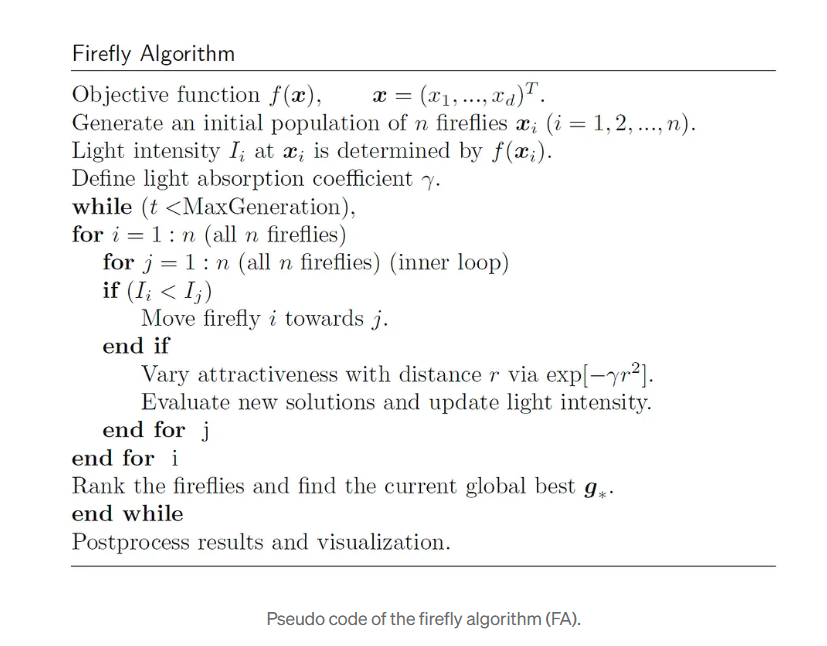

# AI_monologues

## Nature inspired algorithms

#### ThoughtProcess
1. the rain drops falling on earth are spherical and of no other random 3D shape (due to area of curvature and finally energy conservation origins)

2. the meniscus of tube? (why spherical -- ouward and inward)

3. the bird flock flying in certain pattern

4. the patterns of ant armies in which ants are following each other and each ant returning from the trail almost touches the other ant going forward in the queue.

5. why does the water flowing from a tap (even with several distinct holes with spaces in between) does not really fall separated and is eventually merged into a single laminar flow etc.

#### Learnings / Findings
* The efficiency of metaheuristic algorithms can be attributed to the fact that they imitate the best features in nature, especially the selection of the fittest in biological systems which have evolved by natural selection over millions of years. 
* Two important characteristics of metaheuristics are: _intensification_ and _diversification_
* __Intensification__: _Intensification_ intends to search around the current best solutions and select the best candidates or solutions.
* __Diversification__:  _Diversification_ makes sure that the algorithm can explore the search space more efficiently, often by randomization.
* The macroscopic forms we observe in nature are rarely arbitrary; they are the stable equilibria of energy functionals.

* __The Calculus of Raindrops: Spherical Minimization and Aerodynamic Distortion__
    * For a falling raindrop, the external pressure is not uniform. 
    * The aerodynamic pressure is highest at the stagnation point (the bottom of the drop) and decreases towards the sides due to the Bernoulli effect. 
    * This non-uniform pressure distribution forces the drop to flatten at the base, resulting in an oblate spheroid, often described in fluid dynamics literature as a "hamburger" shape.

## The Firefly Algorithm: A Brief Overview
* Fireflies use bioluminescence to communicate and attract mates.
* The following rules are used to describe the standard FA(Firefly Algorithm):
    1. All fireflies are unisex, so one firefly will be attracted to other fireflies regardless of their sex.
    2. Attractiveness is proportional to a firefly’s brightness. Thus for any two flashing fireflies, the less brighter one will move toward the brighter one. The attractiveness is proportional to the brightness, both of which decrease as their distance increases. If there is no brighter one than a particular firefly, it will move randomly.
    3. The brightness of a firefly is affected or determined by the landscape of the objective function.

* #### Algorithm Explanation
1.  