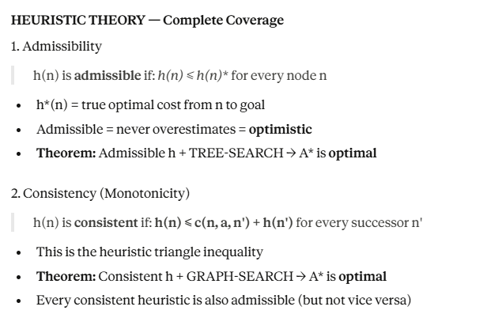
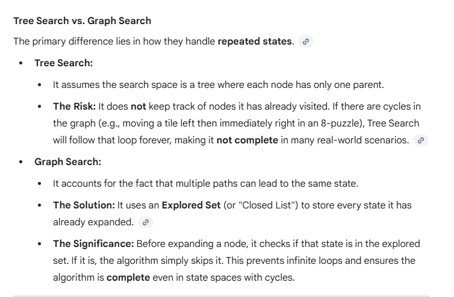
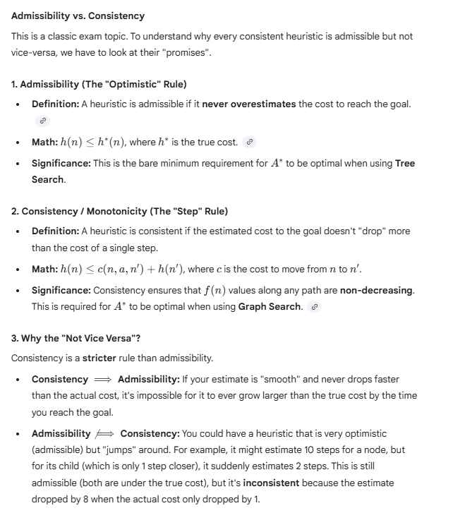
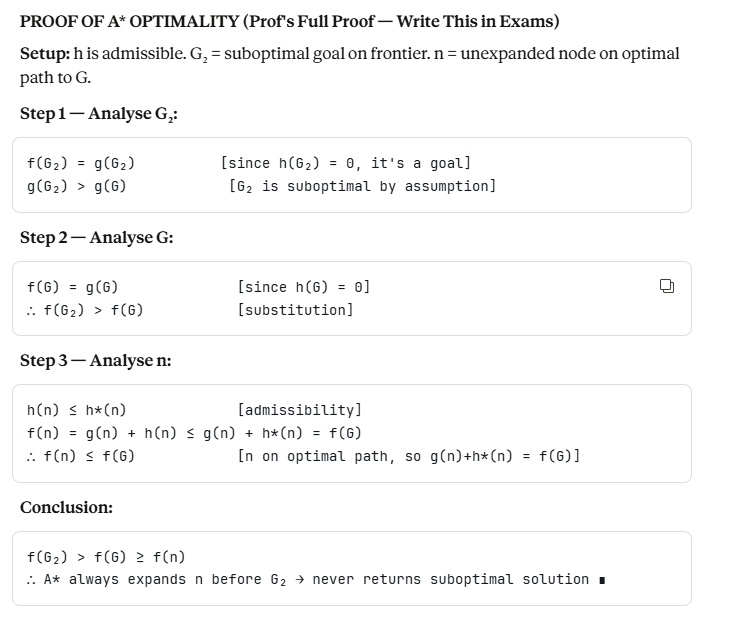
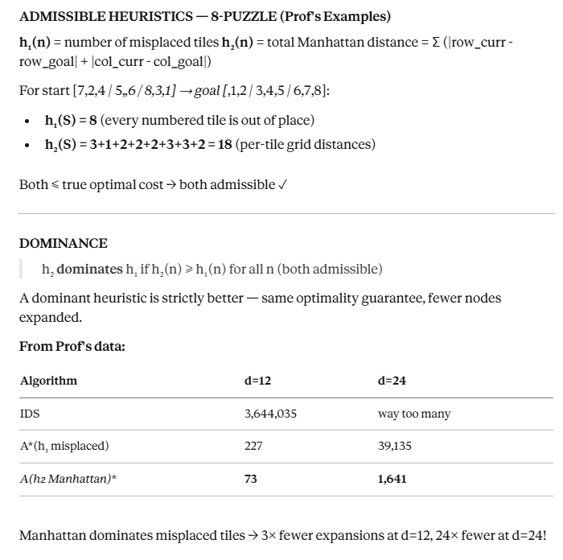
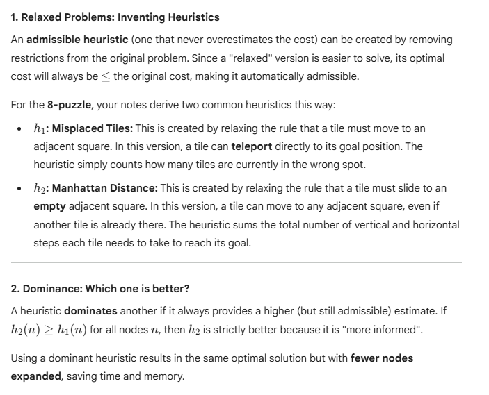
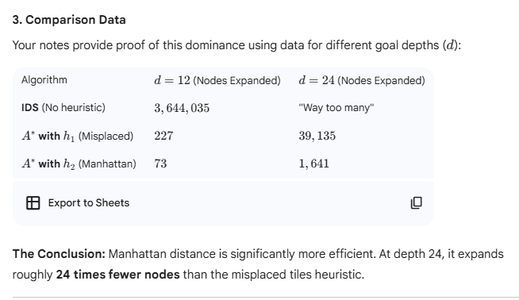

## UNIT II: Problem Solving & Search

#### 1. Defining the Search Variables
When analyzing search algorithms, we use specific variables to measure how much time and memory (space) an algorithm will consume:
    - $b$ (Branching Factor): The maximum number of successors (children) any node can have. If $b=2$, every node splits into two.
    - $d$ (Depth of Solution): The depth of the shallowest goal node (how many steps from the start to the first solution).
    - $m$ (Maximum Depth): The maximum length of any path in the state space. This can be infinite ($\infty$) if there are loops.
    - $C^*$ (Cost of Optimal Solution): The total path cost of the best possible solution.
    - $\epsilon$ (Minimum Step Cost): The smallest possible cost of a single action. This is used in Uniform Cost Search to ensure the algorithm doesn't get stuck in an infinite loop of tiny costs.

#### 2. Uninformed Search Strategies (Blind Search)
These algorithms have no information about how far a node is from the goal; they only know how to generate successors.

###### A. Breadth-First Search (BFS)
    - Mechanism: Expands the shallowest unexpanded node first using a FIFO (First-In-First-Out) queue. It explores the tree layer by layer.
    - Why $O(b^d)$? In the worst case, you must generate every node up to depth $d$. The number of nodes is $1 + b + b^2 + ... + b^d$.
    - The Problem: Space complexity. It keeps every generated node in memory. For a branching factor of 10 and depth 10, this could require terabytes of RAM.

###### B. Depth-First Search (DFS)
    - Mechanism: Expands the deepest unexpanded node first using a LIFO (Last-In-First-Out) stack.
    - Why $O(bm)$? DFS only needs to store the path from the root to the current node, plus the siblings of nodes on that path. This is much more memory-efficient than BFS.
    - The Risk: It is not complete if the tree is infinite or has loops, as it might follow a "dead end" forever.

###### Uniform Cost Search (UCS)
    - Mechanism: Instead of depth, it expands the node $n$ with the lowest path cost $g(n)$ using a Priority Queue.
    - Optimality: Guaranteed to find the cheapest path because it always expands the "cheapest" node currently known.

###### Iterative Deepening Search (IDS)
    - Mechanism: It runs a DFS with a depth limit of 0, then 1, then 2, and so on.
    - The "Magic": It feels wasteful because it re-generates top-level nodes multiple times. However, since the number of nodes at depth $d$ is so much larger than all previous levels combined, the overhead is actually quite small (only about 11% for $b=10$).
    - Conclusion: It is the "Best of Both Worlds"—it has the linear space of DFS ($O(bd)$) and the optimality/completeness of BFS.

#### 3. Informed Search (A Search)*
Informed search uses "hints" called heuristics to find the goal faster.

###### The Evaluation Function: $f(n) = g(n) + h(n)
    - $$g(n)$: The actual cost reached so far from the start node to node $n$.
    - $h(n)$: The estimated cost from node $n$ to the goal. This is the "heuristic."
    - $f(n)$: The estimated total path cost through node $n$.

###### Admissibility and Consistency
For A* to be optimal, the heuristic $h(n)$ must be "well-behaved":
    - Admissible: $h(n)$ must never overestimate the cost. It must be optimistic. If the real cost to the goal is 10, $h(n)$ can be 7 or 10, but never 11.
    - Consistent (Monotonic): The estimate $h(n)$ should not decrease more than the actual cost of moving to a neighbor. Formally: $h(n) \le cost(n, a, n') + h(n')$.

###### Dominance: Comparing Heuristics
If you have two admissible heuristics, $h_1$ and $h_2$, and $h_2(n) \ge h_1(n)$ for all nodes, then $h_2$ dominates $h_1$.
    - Why it matters: A dominating heuristic is "tighter" (closer to the real cost). It provides better guidance and forces A* to expand fewer nodes, making the search more efficient.

---
#### Admissibility
If $h^*(n)$ is the true, actual minimum cost to get from node $n$ to the goal, then $h(n)$ is admissible if and only if:
    $$0 \leq h(n) \leq h^*(n)$$
for all nodes $n$ in the state space.

To be admissible, a heuristic function $h(n)$ must be optimistic. In the context of the A* search algorithm, this means the heuristic never overestimates the actual cost to reach the goal from a given node $n$.

---
## AGENT
In AI, agent is anything that can be viewd as percieving environment through **sensors** and acting upon it through **actuators**.
- Percept: The agent's perceptual inputs at any given instant.
- Percept Sequence: The complete history of everything the agent has ever percieved.
- Agent Function: A mathematical mapping ($f: P^* \to A$) that describes how an agent chooses an action ($A$) based on its entire percept sequence ($P^*$).
- Agent Program: The concrete implementation of the agent function that runs on a physical architecture.

#### The PEAS Framework
To design a rational agent, we must first specify its Task Environment using the PEAS framework.

    - P – Performance Measure: The objective criteria used to evaluate the success of an agent’s behavior (e.g., safety, cost, speed).

    - E – Environment: The external world or context in which the agent operates (e.g., city streets, a laboratory, a virtual network).

    - A – Actuators: The mechanisms the agent uses to perform actions (e.g., wheels, robotic arms, display screens).

    - S – Sensors: The hardware/software the agent uses to receive inputs (e.g., cameras, microphones, GPS, data logs).

Example: Automated Medical Diagnosis System
    - Performance: Healthy patient, minimized costs, minimized legal liability.
    - Environment: Patient, hospital staff.
    - Actuators: Screen display (questions, tests, diagnoses, treatments).
    - Sensors: Keyboard/Voice (symptoms, findings, patient answers).

#### Environment Characteristics
The complexity of an agent's design depends heavily on the properties of its environment. We categorize environments along several dimensions:
    - Fully Observable vs. Partially Observable: Does the agent have access to the complete state of the environment at all times? (e.g., Chess is fully observable; Poker is partially observable).
    - Deterministic vs. Stochastic: Is the next state determined solely by the current state and the agent's action? (e.g., Crossword puzzles are deterministic; Driving is stochastic/uncertain).
    - Episodic vs. Sequential: Is the current decision independent of previous ones? (e.g., Image classification is episodic; Chess is sequential).
    - Static vs. Dynamic: Does the environment change while the agent is deliberating? (e.g., Crossword is static; Taxi driving is dynamic).
    - Discrete vs. Continuous: Are the states and actions finite or infinite? (e.g., Chess has discrete moves; Steering a car is continuous).
    - Known vs. Unknown: Does the agent know the "rules of physics" or the outcomes of its actions beforehand?

#### Agent Structures (Architectures)
As agents become more sophisticated, they incorporate more information into their decision-making process.

A. Simple Reflex Agents
These agents select actions based only on the current percept, ignoring the rest of the percept sequence. They work using Condition-Action Rules (If-Then statements).

    - Pros: Very fast and efficient.

    - Cons: Only work if the environment is fully observable.

B. Model-based Reflex Agents
To handle partial observability, these agents maintain an internal state that tracks parts of the world they cannot currently see.

    - Mechanism: It uses a "model" of how the world evolves and how its own actions affect the world.

C. Goal-based Agents
These agents use goal information to describe desirable situations. They act to reach a specific destination or state.

    - Search and Planning: Unlike reflex agents, they consider the future (e.g., "Will this action lead me closer to my goal?").

D. Utility-based Agents
When there are multiple ways to reach a goal, a utility-based agent chooses the "best" path. It uses a utility function to map a state to a real number representing the agent's "happiness" or degree of satisfaction.

    - Trade-offs: Useful when goals conflict (e.g., speed vs. safety) or when there is uncertainty about reaching the goal.

E. Learning Agents
A learning agent is designed to improve its performance over time. It is divided into four conceptual components:

    - Learning Element: Responsible for making improvements.

    - Performance Element: Responsible for selecting external actions (equivalent to the standard agent).

    - Critic: Provides feedback to the learning element based on a fixed performance standard.

    - Problem Generator: Suggests actions that will lead to new and informative experiences (exploration).

---

- consistency is stricter than admissibilty. which means, a heuristics, if consistent will always be admissible; but a heuristics, which is admissible is not guaranteed to be consistent.

---
## Proof of A* optimality

---
## Concept of DOMINANCE in heuristics

